<p align="center">
  
  
  
  
  
</p>

<h1 align="center">AI Security Lab</h1>
<h3 align="center">Build, Break, and Defend an AI Agent</h3>

<p align="center">
  <strong>A hands-on lab series for cybersecurity professionals learning to secure LLM-powered agent systems.</strong><br/>
  Covers the OWASP Top 10 for LLM Applications, agentic AI threats, and enterprise defense tooling.
</p>

---

## Overview

This lab series takes you from zero to a fully defended AI agent architecture. You will build a deliberately vulnerable AI customer service chatbot, systematically attack it using techniques mapped to the **OWASP Top 10 for LLM Applications**, then implement layered defenses — first from scratch, then with enterprise tools — before adding an AI Gateway and mapping the entire stack to Azure.

**No real LLM API keys required.** The agent uses a deterministic mock LLM engine, keeping the labs reproducible, free, and focused on security mechanics rather than prompt engineering variance.

### Who This Is For

- **Security engineers** building expertise in AI/LLM security
- **IAM professionals** extending identity and access control concepts to AI agents
- **Red teamers** developing AI-specific attack techniques
- **Architects** designing secure AI agent deployments
- **Anyone** with Python basics and a curiosity about how AI systems break

### What You Will Learn


---

## Lab Series

| Lab | Title | Phase | What You Build |
|:---:|-------|:-----:|----------------|
| **0** | [Environment Setup](LAB0-SETUP.md) | Setup | Python venv, FastAPI scaffold, Docker config |
| **1** | [Build the Vulnerable Agent](LAB1-BUILD-AGENT.md) | Build | 7 vulnerable tools, 3 database tables, mock LLM engine |
| **2** | [Attack the Agent](LAB2-ATTACKS.md) | Break | 21 attacks across 5 OWASP categories, CISO briefing |
| **3A** | [Custom Defenses](LAB3A-CUSTOM-DEFENSES.md) | Defend | Input/output guards, RBAC, rate limiter, prompt armor, audit logger |
| **3B** | [Enterprise Defense Tools](LAB3B-ENTERPRISE-TOOLS.md) | Defend | LLM Guard, Microsoft Presidio, Guardrails AI integration |
| **4** | [Agentic Security](LAB4-AGENTIC-SECURITY.md) | Harden | Tool chain analysis, confused deputy guard, human-in-the-loop |
| **5** | [AI Gateway](LAB5-AI-GATEWAY.md) | Govern | Reverse proxy, token rate limiting, cost tracking, Azure APIM mapping |
| **6** | [Azure Deployment](LAB6-AZURE-DEPLOY.md) | Deploy | Cloud reference architecture (Azure APIM, ACA, Entra ID, Key Vault) |

### Learning Progression

```mermaid
graph LR
    L0["**LAB 0**<br/>Setup<br/>🔧"]
    L1["**LAB 1**<br/>Build Agent<br/>🏗️"]
    L2["**LAB 2**<br/>Attack<br/>💥"]
    L3A["**LAB 3A**<br/>Custom<br/>Defense 🛡️"]
    L3B["**LAB 3B**<br/>Enterprise<br/>Defense 🏢"]
    L4["**LAB 4**<br/>Agentic<br/>Security 🤖"]
    L5["**LAB 5**<br/>AI Gateway<br/>🌐"]
    L6["**LAB 6**<br/>Azure<br/>Deploy ☁️"]

    L0 --> L1 --> L2 --> L3A --> L3B --> L4 --> L5 --> L6

    L3A -.->|Defense in Depth| L3B

    style L0 fill:#6c757d,stroke:#fff,color:#fff
    style L1 fill:#0d6efd,stroke:#fff,color:#fff
    style L2 fill:#dc3545,stroke:#fff,color:#fff
    style L3A fill:#198754,stroke:#fff,color:#fff
    style L3B fill:#198754,stroke:#fff,color:#fff
    style L4 fill:#6f42c1,stroke:#fff,color:#fff
    style L5 fill:#fd7e14,stroke:#fff,color:#fff
    style L6 fill:#0dcaf0,stroke:#000,color:#000
```



---

## Architecture

### The Vulnerable Agent (LABs 1–2)

```mermaid
graph TB
    User["👤 User Request"]

    subgraph FastAPI["**FastAPI Application** · agent/app.py"]
        direction TB
        Chat["POST /chat"]
        Admin["GET /admin"]
        Upload["POST /upload"]
        Config["POST /config"]
        Sessions["GET /sessions"]

        LLM["🧠 Mock LLM Engine<br/>agent/llm.py"]

        subgraph Tools["**Agent Tools** · agent/tools.py"]
            T1["lookup_customer<br/>⚠️ SQLi"]
            T2["search_customers<br/>⚠️ Mass dump"]
            T3["read_file<br/>⚠️ Path traversal"]
            T4["execute_query<br/>⚠️ Arbitrary SQL"]
            T5["call_api<br/>⚠️ SSRF"]
            T6["update_customer<br/>⚠️ No auth"]
            T7["get_employee_info<br/>⚠️ SQLi + BAC"]
        end
    end

    DB[("🗄️ SQLite DB<br/>customers · employees<br/>api_keys")]
    HTTP["🌐 External HTTP"]

    User --> Chat
    User --> Admin
    User --> Upload
    Chat --> LLM --> Tools
    T1 & T2 & T4 & T6 & T7 --> DB
    T5 --> HTTP
    T3 -->|"../../etc/passwd"| DB

    style FastAPI fill:#1a1a2e,stroke:#e94560,color:#fff
    style Tools fill:#16213e,stroke:#e94560,color:#fff
    style DB fill:#0f3460,stroke:#e94560,color:#fff
    style User fill:#e94560,stroke:#fff,color:#fff
    style LLM fill:#533483,stroke:#e94560,color:#fff
```



> **Vulnerabilities:** SQLi, SSRF, path traversal, prompt injection, hardcoded secrets, broken auth, IDOR, no RBAC

### The Defended Agent (LABs 3A–4)

```mermaid
graph TB
    User["👤 User Request"]
    Response["✅ Safe Response"]

    RL["⏱️ **Rate Limiter**<br/>429 if over budget"]
    IG["🔍 **Input Guard**<br/>Block injection, SQLi, SSRF"]
    PA["🛡️ **Prompt Armor**<br/>Boundary markers, canary token"]
    LLM["🧠 **Mock LLM**"]
    RBAC["🔐 **RBAC**<br/>Role → tool permissions"]
    TI["🔗 **Tool Interceptor**<br/>Validate args, check chains"]
    OG["📝 **Output Guard**<br/>Redact PII, check canary"]
    AL["📊 **Audit Logger**<br/>JSONL → SIEM"]

    User --> RL
    RL -->|pass| IG
    RL -->|"⛔ 429"| Block1["Blocked"]
    IG -->|pass| PA
    IG -->|"⛔ 400"| Block2["Blocked"]
    PA --> LLM
    LLM --> RBAC
    RBAC -->|permitted| TI
    RBAC -->|"⛔ 403"| Block3["Blocked"]
    TI --> OG
    OG --> AL
    AL --> Response

    style RL fill:#fd7e14,stroke:#fff,color:#fff
    style IG fill:#dc3545,stroke:#fff,color:#fff
    style PA fill:#6f42c1,stroke:#fff,color:#fff
    style LLM fill:#533483,stroke:#fff,color:#fff
    style RBAC fill:#0d6efd,stroke:#fff,color:#fff
    style TI fill:#198754,stroke:#fff,color:#fff
    style OG fill:#20c997,stroke:#000,color:#000
    style AL fill:#6c757d,stroke:#fff,color:#fff
    style User fill:#e94560,stroke:#fff,color:#fff
    style Response fill:#198754,stroke:#fff,color:#fff
    style Block1 fill:#dc3545,stroke:#fff,color:#fff
    style Block2 fill:#dc3545,stroke:#fff,color:#fff
    style Block3 fill:#dc3545,stroke:#fff,color:#fff
```



### The Full Enterprise Stack (LABs 5–6)


---

## Quick Start

```bash
# Clone the repository
git clone https://github.com/<your-username>/ai-security-lab.git
cd ai-security-lab

# Create virtual environment
python3 -m venv .venv
source .venv/bin/activate

# Install dependencies
pip install -r requirements.txt

# Start the vulnerable agent (after completing LAB 1)
python -m agent.app

# In another terminal — test it
curl -s -X POST http://localhost:8000/chat \
  -H "Content-Type: application/json" \
  -d '{"message": "Hello!", "session_id": "test1"}' \
  | python3 -m json.tool
```

> **Start with [LAB0-SETUP.md](LAB0-SETUP.md)** and work through each lab in order. Every lab builds on the previous one.

---

## OWASP LLM Top 10 Coverage

| OWASP Category | Attack (LAB 2) | Defense |
|:---------------|:---------------|:--------|
| **LLM01** Prompt Injection | Direct injection, indirect via upload, role manipulation | Input Guard (3A), LLM Guard ML classifier (3B), Prompt Armor (3A) |
| **LLM02** Insecure Output | PII in responses, credential leakage, XSS vectors | Output Guard (3A), Presidio NER anonymization (3B), Guardrails (3B) |
| **LLM03** Training Data Poisoning | RAG poisoning via document upload | Content scanning on upload, tool output validation (4) |
| **LLM04** Model DoS | Token stuffing, rapid enumeration | Rate Limiter (3A), Gateway token limits (5) |
| **LLM06** Sensitive Disclosure | System prompt extraction, API key exfil, mass PII dump | Output Guard (3A), Presidio (3B), Key Vault (6) |
| **LLM07** Insecure Plugin Design | Dangerous tool chains, unvalidated tool outputs | Tool Chain Analyzer (4), Trust Boundary Enforcer (4) |
| **LLM08** Excessive Agency | SQLi via tools, SSRF, path traversal, unauth writes | RBAC (3A), Confused Deputy Guard (4), Human-in-the-Loop (4) |
| **LLM10** Unbounded Consumption | Uncontrolled API costs, no per-consumer limits | Gateway cost tracking (5), Azure APIM token limits (6) |

---

## IAM ↔ AI Security Mapping

For security professionals with an Identity & Access Management background:

| IAM Concept | AI Security Equivalent | Lab |
|:------------|:----------------------|:---:|
| Least privilege for service accounts | Restricting which tools an agent can invoke | 3A |
| Role-based access control | Scoping agent capabilities by user role | 3A |
| Service account impersonation | Confused deputy — authorize the user, not the agent | 4 |
| Audit logging / SIEM | Logging every tool invocation and LLM call | 3A, 5 |
| Secret rotation / vault | Moving secrets from prompts to Key Vault | 6 |
| API gateway / WAF | AI Gateway with token-aware rate limiting | 5 |
| Conditional Access policies | Per-consumer model access and budget policies | 5, 6 |
| Defense in depth | Layering custom + enterprise + gateway + platform controls | 3–6 |

---

## Tech Stack

| Component | Technology | Purpose |
|:----------|:-----------|:--------|
| Web framework | FastAPI | Agent HTTP API + Gateway |
| Database | SQLite | Mock customer/employee/API key data |
| LLM engine | Mock (pattern-matched) | Deterministic, reproducible, free |
| Injection detection | Custom regex + LLM Guard | Rule-based + ML-based layering |
| PII anonymization | Custom regex + Microsoft Presidio | Pattern + NER-based detection |
| Output governance | Custom validators + Guardrails AI | Business rule enforcement |
| Gateway | Custom FastAPI proxy | Token limiting, routing, cost tracking |
| Cloud mapping | Azure APIM, ACA, Entra ID, Key Vault | Enterprise reference architecture |
| Containerization | Docker (optional) | Isolated deployment |

---

## Project Structure

```
ai-security-lab/
│
├── LAB0-SETUP.md                  # Lab 0: Environment setup
├── LAB1-BUILD-AGENT.md            # Lab 1: Build the vulnerable agent
├── LAB2-ATTACKS.md                # Lab 2: Attack the agent (21 attacks)
├── LAB3A-CUSTOM-DEFENSES.md       # Lab 3A: Build 6 defense modules
├── LAB3B-ENTERPRISE-TOOLS.md      # Lab 3B: LLM Guard, Presidio, Guardrails
├── LAB4-AGENTIC-SECURITY.md       # Lab 4: Tool interception, trust boundaries
├── LAB5-AI-GATEWAY.md             # Lab 5: AI Gateway + Azure APIM mapping
├── LAB6-AZURE-DEPLOY.md           # Lab 6: Azure deployment reference
├── README.md                      # This file
├── requirements.txt               # Python dependencies
├── Dockerfile                     # Container build
├── docker-compose.yml             # Docker orchestration
│
├── agent/                         # The AI Agent (target system)
│   ├── app.py                     # FastAPI application
│   ├── config.py                  # Defense toggles
│   ├── llm.py                     # Mock LLM engine
│   ├── tools.py                   # 7 vulnerable tools
│   ├── system_prompt.py           # Intentionally leaky prompt
│   └── database.py                # SQLite with sensitive data
│
├── defenses/                      # Security controls (LABs 3–4)
│   ├── input_guard.py             # Injection detection
│   ├── output_guard.py            # PII redaction
│   ├── rbac.py                    # Role-based access control
│   ├── rate_limiter.py            # Request throttling
│   ├── prompt_armor.py            # Prompt hardening
│   ├── audit_logger.py            # Security logging
│   ├── llm_guard_scanner.py       # LLM Guard integration
│   ├── presidio_anonymizer.py     # Microsoft Presidio
│   ├── guardrails_validator.py    # Guardrails AI
│   ├── tool_interceptor.py        # Tool call middleware
│   └── trust_boundary.py          # Trust enforcement
│
├── gateway/                       # AI Gateway (LAB 5)
│   ├── proxy.py                   # Reverse proxy core
│   ├── auth.py                    # Consumer authentication
│   ├── token_limiter.py           # Token-based rate limiting
│   ├── content_filter.py          # Org-wide content policies
│   ├── cost_tracker.py            # Per-consumer cost tracking
│   ├── cache.py                   # Response caching
│   ├── router.py                  # Model routing + failover
│   └── logger.py                  # Centralized observability
│
└── tests/                         # Test suite
    ├── test_attacks.py
    └── test_defenses.py
```

---

## References

| Resource | Relevance |
|:---------|:----------|
| [OWASP Top 10 for LLM Applications (2025)](https://owasp.org/www-project-top-10-for-large-language-model-applications/) | Primary attack taxonomy used throughout |
| [MITRE ATLAS](https://atlas.mitre.org/) | AI-specific attack technique framework (LAB 4) |
| [NIST AI Risk Management Framework](https://www.nist.gov/itl/ai-risk-management-framework) | Risk assessment methodology |
| [LLM Guard by Protect AI](https://llm-guard.com/) | ML-based input/output scanning (LAB 3B) |
| [Microsoft Presidio](https://microsoft.github.io/presidio/) | PII detection and anonymization (LAB 3B) |
| [Guardrails AI](https://www.guardrailsai.com/) | Output governance framework (LAB 3B) |
| [Azure APIM GenAI Gateway](https://learn.microsoft.com/en-us/azure/api-management/genai-gateway-capabilities) | Enterprise AI Gateway reference (LABs 5–6) |
| [Azure AI Content Safety](https://learn.microsoft.com/en-us/azure/ai-services/content-safety/) | Prompt Shields, groundedness detection (LAB 6) |

---

## Disclaimer

> **This lab contains intentionally vulnerable code for educational purposes only.**
>
> The agent, tools, and configurations in this repository are designed to demonstrate security vulnerabilities. They contain hardcoded secrets, SQL injection flaws, path traversal vulnerabilities, and other exploitable weaknesses.
>
> **Do not deploy any code from this repository in a production environment or any system accessible to untrusted users.**
>
> The attack techniques demonstrated are for authorized security testing, CTF challenges, and educational contexts only. All fictional data (names, SSNs, API keys) is synthetic and does not correspond to real individuals or services.

---

<p align="center">
  <strong>Build → Break → Defend → Govern</strong><br/>
  <sub>An AI Security Lab Series</sub>
</p>
